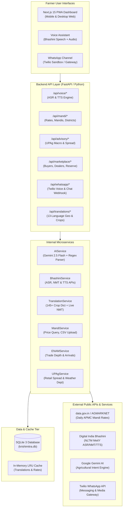
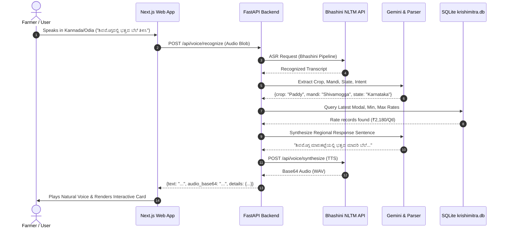
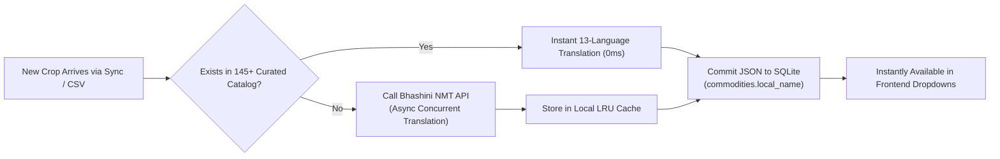

# KrishiMitra AI: Comprehensive App Design & Functional Specifications

> **Unified Hyperlocal Mandi Intelligence, Voice Assistant & Agri-Input Marketplace**  
> Developed by **CrestSubarn** (Founded 2026)  
> *A free, ad-free, pro-farmer public utility powered by Open Government Data & Digital India Bhashini.*

---

## 1. Executive Summary & Product Vision

### 1.1 Purpose and Vision
**KrishiMitra AI** is an end-to-end, multilingual agricultural advisory and market intelligence platform designed specifically for Indian farmers. Agricultural pricing in India often suffers from information asymmetry: farmers selling at local mandis lack real-time visibility into modal rates, interstate trade depth, retail spreads, and certified input supplies. 

KrishiMitra bridges this gap by offering:
- **Speech-First Voice Interaction**: Enables illiterate or semi-literate farmers to speak naturally in their mother tongue to receive instant price intelligence and actionable advisories.
- **Multilingual Support Across 13 Indian Languages**: English, Hindi, Kannada, Gujarati, Marathi, Tamil, Telugu, Malayalam, Punjabi, Bengali, Odia, Assamese, and Kashmiri.
- **Aggregated Official Data Sources**: Live feeds from AGMARKNET (data.gov.in), e-NAM (National Agriculture Market), and UPAg (Unified Portal for Agricultural Statistics / DoCA).
- **Pro-Farmer Public Commitment**: Conceived and engineered by **CrestSubarn** in 2026. While the proprietary codebase is retained under IP protection, the service is **100% free to use**, strictly **ad-free**, with zero monetization or farmer data profiling.

---

## 2. High-Level System Architecture

---

## 3. Core Feature Specifications

### 3.1 Multilingual Voice Assistant
- **Bhashini High-Fidelity Regional Speech Recognition (ASR)**:
  - Farmers tap the microphone and speak queries in their regional tongue (e.g. *"ನನಗೆ ಶಿವಮೊಗ್ಗದಲ್ಲಿ ಭತ್ತದ ಬೆಲೆ ತಿಳಿಸಿ"* or *"ଗୁଜୁରାଟରେ ସୂର୍ଯ୍ୟମୁଖୀ ଦର କେତେ?"*).
  - Audio is converted to WAV/MP3 in the browser or via WhatsApp voice notes and processed by Bhashini ASR.
- **Context-Aware Intent Parsing**:
  - AIService utilizes a dual-engine architecture:
    1. **Rule & Regex Pattern Engine**: Identifies commodities, mandis, and states across native Indic scripts (Devanagari, Kannada, Odia, Gujarati, Tamil, Telugu, etc.) with 0ms latency.
    2. **Gemini 2.5 Flash Fallback**: Handles colloquial vernacular expressions, complex grammatical queries, and contextual advice requests.
- **Dual-Engine Speech Synthesis (TTS)**:
  - Primary: Digital India Bhashini regional neural TTS returning base64 audio.
  - Fallback: HTML5 Web Speech Synthesis with targeted language tags (`kn-IN`, `or-IN`, `hi-IN`, `gu-IN`, etc.).

---

### 3.2 Dual-Format Bilingual Dropdowns
To ensure usability for both regional-language native speakers and English-literate officers or dealers, dropdown menus implement customized bilingual formatting:

1. **State, District, and Mandi Dropdowns**:
   - Format: **`English (Native)`**
   - *Examples*:
     - `Odisha (ଓଡ଼ିଶା)`
     - `Karnataka (ಕರ್ನಾಟಕ)`
     - `Shivamogga (ಶಿವಮೊಗ್ಗ)`
     - `Balangir (ବଲାଙ୍ଗୀର)`
     - `Kantabaji APMC (କଣ୍ଟାବାଞ୍ଜି APMC)`
   - *When English is selected*: Shows clean English string without redundant brackets (e.g. `Odisha`, `Shivamogga`).
2. **Commodities Dropdown**:
   - Format: **`Native (English)`**
   - *Examples in Kannada*: `ಕುಂಬಳಕಾಯಿ (Pumpkin)`, `ಪಡವಲಕಾಯಿ (Snakeguard)`, `ಬದನೆಕಾಯಿ (Brinjal)`, `ಬೆಂಡೆಕಾಯಿ (Bhindi/Ladies Finger)`, `ಸಾಮೆ (Kutki)`
   - *Examples in Odia*: `ବୋଇତାଳୁ (Pumpkin)`, `ବାଇଗଣ (Brinjal)`, `ଭେଣ୍ଡି (Bhindi/Ladies Finger)`, `କଞ୍ଚା ଅଦା (Ginger(Green))`
   - *When English is selected*: Shows clean English crop name (e.g. `Pumpkin`, `Brinjal`).
3. **API Query Preservation**:
   - The `<option value="...">` attributes strictly preserve canonical English names, guaranteeing that backend queries (`/api/mandi/price?state=Odisha&commodity_name=Pumpkin`) remain stable.

---

### 3.3 Dynamic 13-Language Crop Ingestion Pipeline
When new crops enter the database via automated data pulls from `data.gov.in` or via manual CSV uploads:

- **Curated Dictionary Tier**: Covers 145+ staple grains, pulses, oilseeds, spices, fruits, and commercial crops.
- **Bhashini Dynamic Fallback**: Unrecognized crop varieties are dispatched asynchronously to Bhashini NMT for translation into the other 12 Indian languages and stored permanently in SQLite.

---

### 3.4 e-NAM Trade Depth & Auction Badges
- Detects whether a mandi operates on the **e-NAM Unified Market Platform**.
- Displays daily arrival quantities (in Quintals).
- Provides commodity grade and variety information (e.g., *Variety: FAQ / Grade A*).
- Displays trade type badges (*e-Auction*, *Direct Farmgate*).

---

### 3.5 UPAg Macro Intelligence & Seasonal Outlook
- Ingests macroeconomic indicators from the **Unified Portal for Agricultural Statistics (UPAg)** and the **Department of Consumer Affairs (DoCA)**:
  - **Wholesale-to-Retail Spread**: Highlights middlemen margins (e.g., *+38.5% Retail Margin over Mandi Wholesale*).
  - **CWWG Rainfall Departure**: Monitors precipitation departures and reservoir storage percentages.
  - **Strategic Farmer Advisories**: Generates real-time suggestions (e.g., *"Immediate sale recommended due to seasonal supply influx"* vs *"Hold stock in certified warehouse"*).

---

### 3.6 Hyperlocal Marketplace & Dealer Reservations
- **Verified Wholesalers & Aggregators**: Connects farmers directly with buyers, displaying ratings, purchasing focus, and live contact buttons (Phone Call & WhatsApp).
- **Certified Agri-Input Dealers**: Enables farmers to browse fertilizer, seed, and pesticide inventory (e.g., Urea, DAP, Micronutrients, Organic Fungicides).
- **One-Click In-App Reservation**: Farmers can reserve essential inputs at authorized local dealer outlets for pickup, securing supplies during peak planting seasons.

---

### 3.7 Omnichannel WhatsApp Gateway
- **Twilio Integration (`/api/whatsapp/twilio`)**: Allows farmers to query prices, send voice notes, and receive interactive markdown summaries directly on WhatsApp without opening a browser.
- **Deep Hyperlink Navigation**: WhatsApp responses include structured deep links (e.g., `https://krishi-mitra-crestsubarn.vercel.app/?tab=mandi&mandi=Indore&commodity=Wheat`) that open the web app directly into the selected mandi's 7-day trend view.

---

## 4. Database Schema Specifications (SQLite 3)

The persistent datastore resides in `krishimitra.db`:

```mermaid
erDiagram
    COMMODITIES ||--o{ DAILY_PRICES : "priced in"
    MANDIS ||--o{ DAILY_PRICES : "recorded at"
    MANDIS ||--o{ BUYERS : "located near"
    MANDIS ||--o{ DEALERS : "serviced by"
    DEALERS ||--o{ RESERVATIONS : "receives"

    COMMODITIES {
        TEXT id PK
        TEXT commodity_name
        TEXT local_name "JSON containing 13 languages"
        TEXT category
    }

    MANDIS {
        TEXT id PK
        TEXT mandi_name
        TEXT district
        TEXT state
        REAL latitude
        REAL longitude
    }

    DAILY_PRICES {
        TEXT id PK
        TEXT mandi_id FK
        TEXT commodity_id FK
        REAL min_price
        REAL max_price
        REAL modal_price
        TEXT price_date
        INTEGER arrivals_qty
        TEXT variety
        TEXT grade
        INTEGER is_enam
    }

    BUYERS {
        TEXT id PK
        TEXT name
        TEXT phone
        TEXT commodities_handled
        TEXT mandi_name
        REAL rating
    }

    DEALERS {
        TEXT id PK
        TEXT shop_name
        TEXT owner_name
        TEXT phone
        TEXT district
        TEXT state
        TEXT inventory "JSON array of inputs"
        REAL rating
    }

    RESERVATIONS {
        TEXT id PK
        TEXT dealer_id FK
        TEXT item_name
        INTEGER quantity
        TEXT farmer_phone
        TEXT status
        TEXT created_at
    }
```

---

## 5. API Endpoints Reference

| Method | Route | Description |
| :--- | :--- | :--- |
| `POST` | `/api/query` | Natural language agricultural intent query (returns prices + text) |
| `POST` | `/api/voice/recognize` | Digital India Bhashini audio ASR processing |
| `POST` | `/api/voice/synthesize` | Digital India Bhashini TTS voice synthesis |
| `GET` | `/api/translations/locations` | Comprehensive 13-language state and district dictionary |
| `GET` | `/api/mandi/states` | List of all states with recorded market data |
| `GET` | `/api/mandi/districts` | List of districts for a specific state |
| `GET` | `/api/mandi/list` | List of APMC mandis within a district |
| `GET` | `/api/mandi/commodities` | List of registered commodities with multilingual names |
| `GET` | `/api/mandi/price` | Live modal, min, and max price for a crop at a mandi |
| `GET` | `/api/mandi/details` | Geographic and district coordinates for a mandi |
| `GET` | `/api/advisory/market-outlook` | UPAg macro intelligence, retail spread, and rainfall departures |
| `GET` | `/api/marketplace/buyers` | Verified wholesalers and buyers with contact options |
| `GET` | `/api/marketplace/dealers` | Certified input dealers and live inventory |
| `POST` | `/api/marketplace/reserve` | Submit an input reservation at an authorized dealer |
| `POST` | `/api/mandi/upload-csv` | Admin CSV price rate ingestion with PIN validation |
| `POST` | `/api/whatsapp/twilio` | Inbound WhatsApp webhook for Twilio messages & audio |

---

## 6. Non-Functional & Operational Standards

1. **Zero Farmer Profiling & Free Access**:
   - The application does not require mandatory registration, logins, or tracking cookies for farmers looking up mandi rates.
   - Strictly non-commercial and ad-free.
2. **Offline-First Resilience**:
   - Dropdown state and district maps include in-app fallback bundles so farmers with intermittent 2G/3G connectivity can navigate records without blank screens.
   - PWA caching stores the latest fetched mandi rates locally.
3. **Accessibility**:
   - High-contrast green and amber indicators conforming to WCAG 2.1 AA guidelines.
   - Large touch targets tailored for sunlight visibility on outdoor mobile displays.
